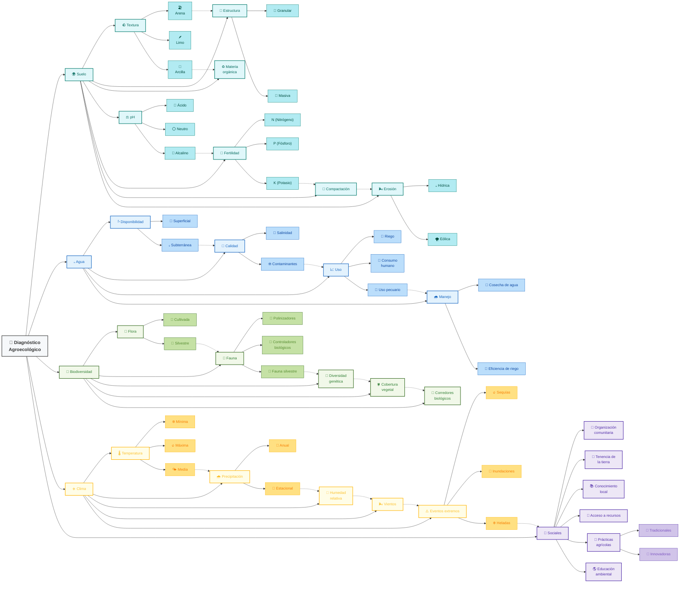

# 🌱 Diagnóstico Agroecológico

Visualización conceptual de los principales aspectos a evaluar, con enfoque moderno y minimalista.

```mermaid
flowchart LR
    %% Nodos principales
    A["🌱 Diagnóstico<br>Agroecológico"]:::principal
    A --> B["🌍 Suelo"]:::suelo
    A --> C["💧 Agua"]:::agua
    A --> D["🐝 Biodiversidad"]:::biodiversidad
    A --> E["☀️ Clima"]:::clima
    A --> F["🤝 Sociales"]:::social

    %% Suelo
    B --> B1["🪨 Textura"]:::suelo
    B1 --> B1a["🏖<br>Arena"]:::sueloSec
    B1 --> B1b["🪶<br>Limo"]:::sueloSec
    B1 --> B1c["🧱<br>Arcilla"]:::sueloSec

    B --> B2["🧩 Estructura"]:::suelo
    B2 --> B2a["🔹 Granular"]:::sueloSec
    B2 --> B2b["🔸 Masiva"]:::sueloSec

    B --> B3["♻️ Materia<br>orgánica"]:::suelo
    B --> B4["⚖️ pH"]:::suelo
    B4 --> B4a["🍋 Ácido"]:::sueloSec
    B4 --> B4b["⚪ Neutro"]:::sueloSec
    B4 --> B4c["🧂 Alcalino"]:::sueloSec
    B --> B5["🌾 Fertilidad"]:::suelo
    B5 --> B5a["N (Nitrógeno)"]:::sueloSec
    B5 --> B5b["P (Fósforo)"]:::sueloSec
    B5 --> B5c["K (Potasio)"]:::sueloSec
    B --> B6["🚜 Compactación"]:::suelo
    B --> B7["🌬 Erosión"]:::suelo
    B7 --> B7a["💧 Hídrica"]:::sueloSec
    B7 --> B7b["🌪 Eólica"]:::sueloSec

    %% Agua
    C --> C1["💦 Disponibilidad"]:::agua
    C1 --> C1a["🌊 Superficial"]:::aguaSec
    C1 --> C1b["💧 Subterránea"]:::aguaSec
    C --> C2["🔬 Calidad"]:::agua
    C2 --> C2a["🧂 Salinidad"]:::aguaSec
    C2 --> C2b["☣️ Contaminantes"]:::aguaSec
    C --> C3["📈 Uso"]:::agua
    C3 --> C3a["🚿 Riego"]:::aguaSec
    C3 --> C3b["🥤 Consumo<br>humano"]:::aguaSec
    C3 --> C3c["🐄 Uso pecuario"]:::aguaSec
    C --> C4["🌧 Manejo"]:::agua
    C4 --> C4a["🛟 Cosecha de agua"]:::aguaSec
    C4 --> C4b["📏 Eficiencia de riego"]:::aguaSec

    %% Biodiversidad
    D --> D1["🌿 Flora"]:::biodiversidad
    D1 --> D1a["🌾 Cultivada"]:::biodiversidadSec
    D1 --> D1b["🌳 Silvestre"]:::biodiversidadSec
    D --> D2["🦋 Fauna"]:::biodiversidad
    D2 --> D2a["🐝 Polinizadores"]:::biodiversidadSec
    D2 --> D2b["🐞 Controladores<br>biológicos"]:::biodiversidadSec
    D2 --> D2c["🦉 Fauna silvestre"]:::biodiversidadSec
    D --> D3["🧬 Diversidad<br>genética"]:::biodiversidad
    D --> D4["🍀 Cobertura<br>vegetal"]:::biodiversidad
    D --> D5["🌱 Corredores<br>biológicos"]:::biodiversidad

    %% Clima
    E --> E1["🌡 Temperatura"]:::clima
    E1 --> E1a["❄️ Mínima"]:::climaSec
    E1 --> E1b["🔥 Máxima"]:::climaSec
    E1 --> E1c["🌤 Media"]:::climaSec
    E --> E2["🌧 Precipitación"]:::clima
    E2 --> E2a["📆 Anual"]:::climaSec
    E2 --> E2b["🍂 Estacional"]:::climaSec
    E --> E3["💨 Humedad<br>relativa"]:::clima
    E --> E4["🌬 Vientos"]:::clima
    E --> E5["⚠️ Eventos extremos"]:::clima
    E5 --> E5a["🔥 Sequías"]:::climaSec
    E5 --> E5b["🌊 Inundaciones"]:::climaSec
    E5 --> E5c["❄️ Heladas"]:::climaSec

    %% Sociales
    F --> F1["👥 Organización<br>comunitaria"]:::social
    F --> F2["📜 Tenencia de<br>la tierra"]:::social
    F --> F3["📚 Conocimiento<br>local"]:::social
    F --> F4["🔑 Acceso a recursos"]:::social
    F --> F5["🌾 Prácticas<br>agrícolas"]:::social
    F5 --> F5a["🏺 Tradicionales"]:::socialSec
    F5 --> F5b["🚜 Innovadoras"]:::socialSec
    F --> F6["🌎 Educación<br>ambiental"]:::social

    %% ESTILOS CORPORATIVOS Y ESPACIADO
    classDef principal fill:#f6f8fa,stroke:#333,stroke-width:2px,font-size:20px,font-weight:bold;
    classDef suelo fill:#e0f7fa,stroke:#00796b,stroke-width:2px,color:#00695c;
    classDef sueloSec fill:#b2ebf2,stroke:#00796b,color:#004d40;
    classDef agua fill:#e3f2fd,stroke:#1565c0,stroke-width:2px,color:#1565c0;
    classDef aguaSec fill:#bbdefb,stroke:#1565c0,color:#0d47a1;
    classDef biodiversidad fill:#f1f8e9,stroke:#33691e,stroke-width:2px,color:#2e7d32;
    classDef biodiversidadSec fill:#c5e1a5,stroke:#33691e,color:#558b2f;
    classDef clima fill:#fffde7,stroke:#ffb300,stroke-width:2px,color:#fbc02d;
    classDef climaSec fill:#ffe082,stroke:#ffb300,color:#f57c00;
    classDef social fill:#ede7f6,stroke:#512da8,stroke-width:2px,color:#512da8;
    classDef socialSec fill:#d1c4e9,stroke:#512da8,color:#7e57c2;

    %% Separadores (Espaciadores visuales)
    B1a -.-> B2
    B1c -.-> B3
    B4c -.-> B5
    B5c -.-> B6
    B6 -.-> B7
    C1b -.-> C2
    C2b -.-> C3
    C3c -.-> C4
    D1b -.-> D2
    D2c -.-> D3
    D3 -.-> D4
    D4 -.-> D5
    E1c -.-> E2
    E2b -.-> E3
    E3 -.-> E4
    E4 -.-> E5
    E5c -.-> F
```
